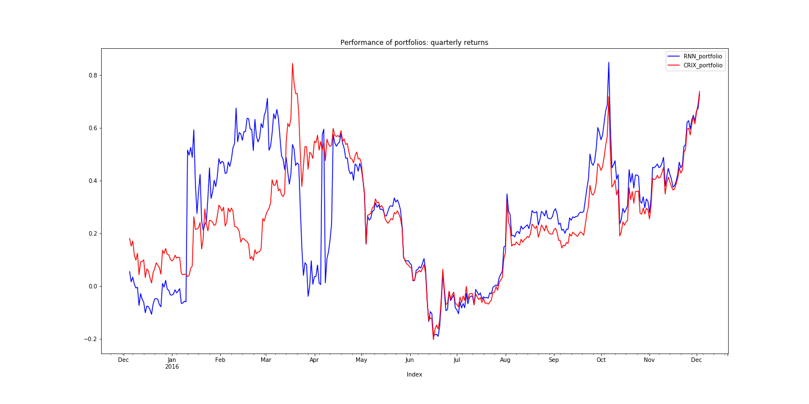
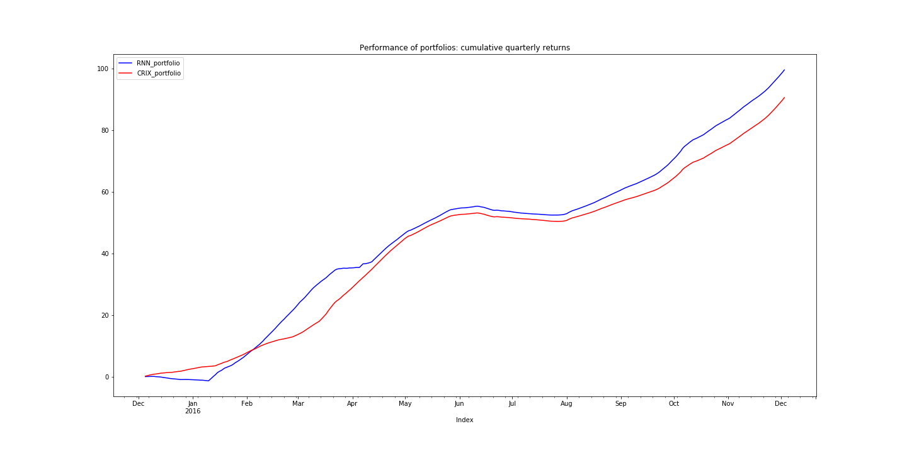

[](http://quantlet.de/)

## [](http://quantlet.de/) **CRIXrnn** [](http://quantlet.de/)

```yaml

Name of Quantlet : CRIXrnn

Published in : Statistics of Financial Markets 5

Description : 'Build a cryptocurrency portfolio based on price movements forecasts with recurrent neural networks in order to outperform CRIX'

Keywords : recurrent neural networks, deep learning, cryptocurrency, CRIX, portfolio, prediction, time series, stock price forecast

Author : SPILAK Bruno

Submitted : 2017/11/30

Datafile :
- dldata
- Data.csv
- btc_model.hdf5
- ltc_model.hdf5
- xmr_model.hdf5
- xrp_model.hdf5
- doge_model.hdf5
- dash_model.hdf5
- nmc_model.hdf5
- nxt_model.hdf5

Output :
- dataset.pkl
- Return.pkl
- TotalLabeled.pkl
- CRIXrnn1
- CRIXrnn2
- RNN models architectures
- Report on the classification forecasts
- Report on the portfolio performance
- Graphs of the portfolio performance

```





### PYTHON Code
```python

import pandas as pd
from sklearn.metrics import classification_report,confusion_matrix
from dldata.dldata_tools import series_to_supervised_multi, dataComplete, results_rnn, save_object
#data
dataset, Return, TotalLabeled = dataComplete()

#Save object so we do not have to recreate the tables for different testing
save_object(dataset, 'dataset.pkl')
save_object(Return, 'Return.pkl')
save_object(TotalLabeled, 'TotalLabeled.pkl')


testLabeled = pd.DataFrame()
testLabeled = TotalLabeled[-365:]
cryptos = list(dataset.columns[0:8])
Results = pd.DataFrame()
prices = pd.DataFrame()
prices = dataset[cryptos+['crix']][-(365+90):]
prices = series_to_supervised_multi(prices,0,91)
#clean data
for curr in cryptos + ['crix']:
    for i in range(1,90):
        del prices['%s(t+%d)' % (curr,i)]

#results of different models
for crypto in cryptos:
    results_rnn(Return, testLabeled, crypto)
#Model diagnosis
print('Performance report for the 8 crypto models')
print('Confusion matrix')
for crypto in cryptos:
    print()
    print('RNN performance for %s_return(t+90)' % crypto)
    print()
    print('Confusion matrix')
    print(confusion_matrix(testLabeled['class_%s_return(t+90)' % crypto],testLabeled['rnn_class_%s_return(t+90)' % crypto]))
    print()
    print('Classification report')
    print(classification_report(testLabeled['class_%s_return(t+90)' % crypto],testLabeled['rnn_class_%s_return(t+90)' % crypto]))
    print()
#Accuracies are good, F1 score more constrated

rnn_class =  list(filter(lambda x: 'rnn' in x, list(filter(lambda x: 'class' in x, testLabeled.columns))))
todayRnnPrices = (testLabeled[rnn_class] * prices.iloc[:,0:8].values).sum(1)
LaterRnnPrices = (testLabeled[rnn_class] * prices.iloc[:,9:17].values).sum(1)
Results['RNN_portfolio'] = (LaterRnnPrices-todayRnnPrices)/todayRnnPrices
Results['CRIX_portfolio'] = testLabeled['crix_return(t+90)']

#Model performance
print('Quarterly returns of RNN portfolio')
print(Results['RNN_portfolio'][[90,180,270,360]])
print()

print('Quarterly returns of CRIX portfolio')
print(Results['CRIX_portfolio'][[90,180,270,360]])
print()

print("Number of quarterly portfolio that outperforms CRIX")
pd.DataFrame(Results['RNN_portfolio'] > Results['CRIX_portfolio'])[0].value_counts()
print("Percentage of quarterly protfolio that outperforms CRIX")
print('{:.1f}'.format(235*100/(365)) + ' %')

#Plots
Results.plot(title='Performance of portfolios: quarterly returns', figsize = (10,5), color = ['blue','red'])
Results.cumsum().plot(title='Performance of portfolios: cumulative quarterly returns',
                      figsize = (10,5),
                      color = ['blue','red'])


'''
dataset, Return, TotalLabeled = dataComplete()
testLabeled = pd.DataFrame()
testLabeled = TotalLabeled[-365:]
cryptos = list(dataset.columns[0:8])


Results = pd.DataFrame()
prices = pd.DataFrame()
prices = dataset[cryptos+['crix']][-(365+90):]
prices = series_to_supervised_multi(prices,0,91)
#clean data
for curr in cryptos + ['crix']:
    for i in range(1,90):
        del prices['%s(t+%d)' % (curr,i)]

#results of different models
for crypto in cryptos:
    results_rnn(Return, testLabeled, crypto)
#Model diagnosis
print('Performance report for the 8 crypto models')
print('Confusion matrix')
for crypto in cryptos:
    print()
    print('RNN performance for %s_return(t+90)' % crypto)
    print()
    print('Confusion matrix')
    print(confusion_matrix(testLabeled['class_%s_return(t+90)' % crypto],testLabeled['rnn_class_%s_return(t+90)' % crypto]))
    print()
    print('Classification report')
    print(classification_report(testLabeled['class_%s_return(t+90)' % crypto],testLabeled['rnn_class_%s_return(t+90)' % crypto]))
    print()
#Accuracies are good, F1 score more constrated

rnn_class =  list(filter(lambda x: 'rnn' in x, list(filter(lambda x: 'class' in x, testLabeled.columns))))
todayRnnPrices = (testLabeled[rnn_class] * prices.iloc[:,0:8].values).sum(1)
LaterRnnPrices = (testLabeled[rnn_class] * prices.iloc[:,9:17].values).sum(1)
Results['RNN_portfolio'] = (LaterRnnPrices-todayRnnPrices)/todayRnnPrices
Results['CRIX_portfolio'] = testLabeled['crix_return(t+90)']

#Model performance
print('Quarterly returns of RNN portfolio')
print(Results['RNN_portfolio'][[90,180,270,360]])
print()

print('Quarterly returns of CRIX portfolio')
print(Results['CRIX_portfolio'][[90,180,270,360]])
print()

print("Number of quarterly portfolio that outperforms CRIX")
pd.DataFrame(Results['RNN_portfolio'] > Results['CRIX_portfolio'])[0].value_counts()
print("Percentage of quarterly protfolio that outperforms CRIX")
print('{:.1f}'.format(235*100/(365)) + ' %')

#Plots
Results.plot(title='Performance of portfolios: quarterly returns', figsize = (10,5), color = ['blue','red'])
Results.cumsum().plot(title='Performance of portfolios: cumulative quarterly returns',
                      figsize = (10,5),
                      color = ['blue','red'])
'''
```

automatically created on 2018-05-28